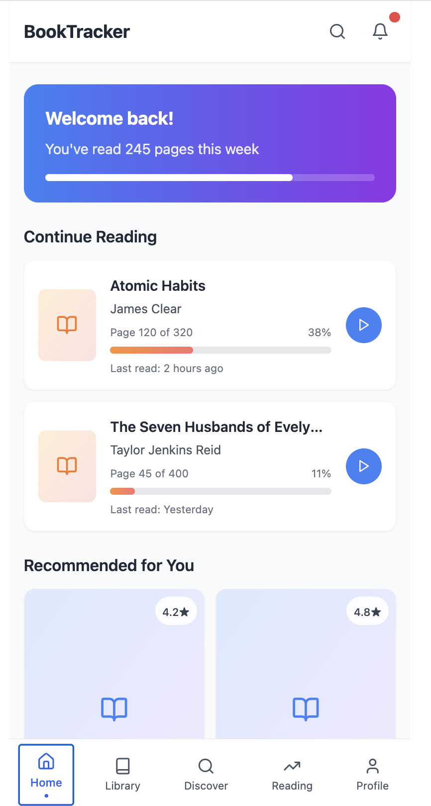
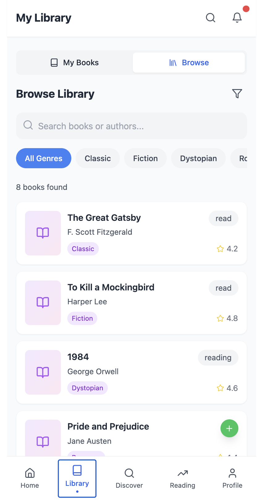

# 📚 Book Tracker App

A full-stack web application for managing your reading list, built with **Flask** (backend) and **React + TypeScript** (frontend).
 
> **Live Preview:** https://book-app.cinte.id/




---

## ✨ Features

- 📖 Browse all books from the backend with live search & genre filter
- 🏷️ Change reading status per book via interactive dropdown (**Want to Read / Reading / Read**)
- 🏠 Home dashboard with "Continue Reading" and "Recommended for You" sections
- 📊 **Profile page** with live reading stats synced from backend data:
  - Books Read, Currently Reading, Want to Read counts
  - Average rating, total books, total pages read
  - Favorite genre (auto-detected)
  - Recently Read list
- 🔄 Single source of truth — all tabs share one global book state (no redundant API calls)
- ⚡ Local search & filter (no extra fetch on every keystroke)
- 💀 Skeleton loading states on Library and Browse pages
- 📱 Fully responsive mobile-first UI (max-w-md)

---

## 🛠 Tech Stack

### Backend
| Tech | Version |
|---|---|
| Python | 3.x |
| Flask | latest |
| Flask-CORS | latest |
| python-dotenv | latest |

Data is persisted in a local `books.json` file.

### Frontend
| Tech | Version |
|---|---|
| React | 18 |
| TypeScript | 5.x |
| Vite | 5.x |
| Tailwind CSS | 3.x |
| shadcn/ui | latest |
| Axios | latest |
| Lucide React | latest |

---

## 🚀 Getting Started

### Prerequisites
- Python 3.x
- Node.js 16.x or later
- npm or yarn

### Backend Setup

```bash
cd backend

# Create & activate virtual environment
python -m venv venv
source venv/bin/activate        # macOS/Linux
# venv\Scripts\activate         # Windows

# Install dependencies
pip install -r requirements.txt

# Start the Flask server
python app.py
```

Backend runs at → `http://localhost:5000`

### Frontend Setup

```bash
cd frontend

# Install dependencies
npm install

# Start the dev server
npm run dev
```

Frontend runs at → `http://localhost:5173`

---

## 📡 API Endpoints

| Method | Endpoint | Description |
|---|---|---|
| `GET` | `/api/books` | Get all books (supports `?search=` and `?genre=` query params) |
| `POST` | `/api/books` | Add a new book |
| `PUT` | `/api/books/<id>` | Update a book (e.g. change status) |
| `DELETE` | `/api/books/<id>` | Delete a book |
| `GET` | `/api/test` | CORS health check |

**Book status values:** `want-to-read` | `reading` | `read`

---

## 🗂 Project Structure

```
book-app-test/
├── backend/
│   ├── app.py              # Flask API & routes
│   ├── books.json          # Persistent book data (JSON)
│   ├── requirements.txt    # Python dependencies
│   └── Dockerfile
├── frontend/
│   └── src/
│       ├── components/
│       │   ├── BookCard.tsx        # Book card with StatusDropdown
│       │   ├── BrowseLibrary.tsx   # Browse tab (props-based, no own fetch)
│       │   ├── HeaderNav.tsx       # Top navigation bar
│       │   ├── BottomNav.tsx       # Bottom tab bar
│       │   └── ProgressCard.tsx    # Reading progress card
│       ├── pages/
│       │   ├── Index.tsx           # Main page — global state & tab renderer
│       │   ├── BookDetail.tsx      # Book detail page
│       │   └── NotFound.tsx
│       ├── services/
│       │   └── api.ts              # Axios API service
│       └── data/
│           └── dummyData.ts        # Static fallback / dummy data
├── assets/
│   ├── home.png
│   └── library.png
└── README.md
```

---

## 👩‍💻 My Contribution (Fullstack Role)

> Applied role: **Fullstack**  
> Based on task: [`TASKS_FULLSTACK.md`](TASKS_FULLSTACK.md)

### Summary of Changes

This fork implements the Fullstack tasks — completing the Library Browse page and extending the UI with real backend integration across all tabs.

---

### 🔁 Architecture Refactor — Single Source of Truth (`Index.tsx`)

**Problem in original:** `BrowseLibrary` fetched its own books independently. My Books tab used static dummy data. There was no shared state — tabs were completely disconnected.

**Solution:** Moved all data fetching into `Index.tsx` using a single `allBooks` state + `fetchAllBooks()`. All tabs — Library (My Books & Browse), Discover, and Profile — now read from and write to this shared state.

```
Index.tsx
├── allBooks (state)
├── fetchAllBooks() → GET /api/books
├── handleStatusChange() → PUT /api/books/:id → update allBooks
├── handleBooksChange() → called by BrowseLibrary
│
├── <BrowseLibrary books={allBooks} onBooksChange={handleBooksChange} />
├── <BookCard onStatusChange={handleStatusChange} />  ← all variants
└── Profile tab reads allBooks directly for live stats
```

---

### 📦 Changed Files

#### `frontend/src/pages/Index.tsx`
- Added `useEffect` + `useCallback` to fetch all books from backend on mount
- Introduced `allBooks` state as global source of truth shared across all tabs
- Replaced static `books` dummy import with live API data in: Home (Recommended), Library (My Books grid), Discover (Trending Now)
- Added `handleStatusChange()` — calls `PUT /api/books/:id` and updates local state optimistically
- Added `handleBooksChange()` — propagates BrowseLibrary status changes back up
- **Profile tab** completely rebuilt: stats (Books Read, Reading, Want to Read, Avg Rating, Total Books, Pages Read, Favorite Genre, Recently Read) are now computed live from `allBooks` instead of hardcoded dummy values
- Added skeleton loading state for My Books grid
- Added empty-state message with CTA to Browse when library is empty

#### `frontend/src/components/BrowseLibrary.tsx`
- Removed self-contained fetch logic (`getBooks`, `useCallback`)
- Now accepts `books: Book[]` and `onBooksChange` as props — no longer fetches independently
- Genre list and filtered books are derived via `useMemo` from the `books` prop (no extra API call on filter/search change)
- Local filtering replaces server-side filtering — instant results, no debounce delay for genre change
- Status badge logic updated: **Want to Read** → blue badge; **Reading / Read** → gray badge; no status → green "+" button to add

#### `frontend/src/components/BookCard.tsx`
- Added `onStatusChange?: (bookId, newStatus) => void` prop
- Added `StatusDropdown` sub-component: a dropdown button on the library card that lets users switch status between Want to Read / Reading / Read — with optimistic loading spinner
- `library` variant now shows `StatusDropdown` instead of static text badge
- Cleaned up JSX formatting with consistent 4-space indentation

#### `frontend/src/components/BottomNav.tsx`
- Minor formatting cleanup (4-space indent, self-closing tags)
- No functional changes

#### `frontend/src/components/HeaderNav.tsx`
- Minor formatting cleanup (4-space indent, self-closing `<span />`)
- No functional changes

#### `frontend/src/data/dummyData.ts`
- Updated `readingStats.totalBooks` from `47` → `8` (realistic seed value)
- Updated `readingStats.avgRating` from `4.3` → `4.5`

---

### 🎯 Key Design Decisions

| Decision | Reason |
|---|---|
| Single fetch in `Index.tsx`, not per-tab | Avoids redundant API calls; all tabs stay in sync |
| `useMemo` for filter/genre in BrowseLibrary | Instant filtering without extra network requests |
| `StatusDropdown` in BookCard | Better UX — status change is inline, no page reload needed |
| Optimistic UI update before API resolves | Feels faster; reverts on failure |
| Profile stats computed from `allBooks` | Stats always reflect actual backend data, not stale dummy values |

---

## 🔮 Future Enhancements

- [ ] Authentication & user accounts
- [ ] Sorting options (by title, author, rating, pages)
- [ ] Book detail edit form
- [ ] Reading progress tracking (pages read)
- [ ] Book reviews & notes
- [ ] Database integration (PostgreSQL / SQLite)
- [ ] CI/CD with GitHub Actions
- [ ] Unit & integration tests

---

## 📋 Test Instruction (Original)

<details>
<summary>Click to expand original recruitment test instructions</summary>

Hi there! 👋  
Thanks for applying to our company.

This is a small take-home assignment where you'll contribute to a simple **Book Tracker App**.  
You can choose how to contribute based on your strongest area: **Frontend, Backend, DevOps, QA, or Data**.

**Goal:** We want to see how you solve problems, write code, and structure your work — all in about **2–4 hours**.

**What to Do:**
1. Fork this repo into your own GitHub account
2. Pick ONE area: Frontend / Backend / DevOps / QA / Data / PM / UI/UX / Customer Service
3. Work only in the part that fits your chosen role
4. Push your code and include in your README: your role, how to run/test, and any decisions made
5. Create a Pull Request (PR) to the main branch
6. Share the PR link for review

**Tasks by Role:**
- [Fullstack](TASKS_FULLSTACK.md) - Complete Library Browse page features
- [Frontend](TASKS_FRONTEND.md) - Build User Authentication, Settings, and Insight UIs
- [Backend](TASKS_BACKEND.md) - Build REST API with search and filtering
- [DevOps](TASKS_DEVOPS.md) - Create Dockerfiles and CI/CD workflows
- [QA](TASKS_QA.md) - Create comprehensive test plans and execute testing
- [UI/UX](TASKS_UIUX.md) - Design User Authentication and Settings pages
- [PM](TASKS_PM.md) - Create project timelines and task breakdowns
- [Data](TASKS_DATA.md) - Build data analytics solution and dashboard
- [Customer Service](TASKS_CUSTOMER_SERVICE.md) - Create customer support system

</details>

---

## 📄 License

MIT License — see [LICENSE](LICENSE) for details.
